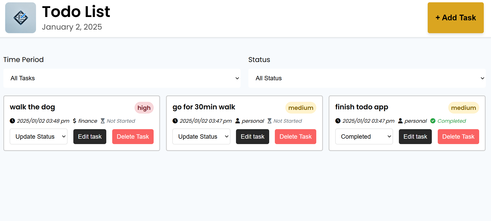
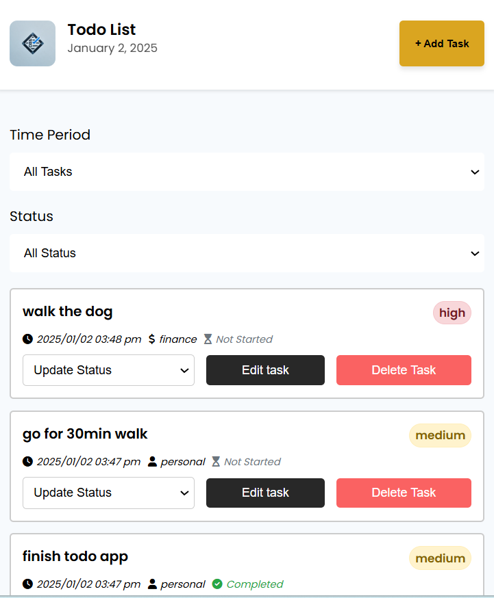

# To-Do App

A simple and interactive To-Do application that allows users to add, update, change the status, and delete tasks. Built using **HTML**, **CSS**, and **JavaScript**, this app provides a responsive and user-friendly experience.

## Features
- **Add Tasks**: Users can add new tasks to their to-do list.
- **Update Tasks**: Users can edit or update task names.
- **Change Task Status**: Allows users to mark tasks as completed or pending.
- **Delete Tasks**: Users can remove tasks from the list.
- **Responsive Design**: The app adapts to different screen sizes for both desktop and mobile views.

## Technologies Used
- **HTML**: For the structure and layout of the app.
- **CSS**: For styling and responsive design.
- **JavaScript**: For interactive functionality, including adding, editing, and deleting tasks.

## How to Use
1. **Add a Task**: Type a task in the input box and press **Enter** or click the **Add Task** button to add it to the list.
2. **Update a Task**: Click on a task to edit and update its text.
3. **Change Task Status**: Click the status checkbox to mark a task as **Completed** or **Pending**.
4. **Delete a Task**: Click the delete icon to remove a task from the list.

## Live Demo
You can view the app here: [Live Demo](https://todo-list-app-liart-seven.vercel.app/)

## Screenshots

### Desktop and Mobile View

<div style="display: flex; flex-direction: column; gap: 20px;">
    
    
</div>

## Installation

If you would like to run this app locally, follow these steps:

1. Clone the repository:
   ```bash
   git clone https://github.com/gitere001/100-javascript-challenges.git

2. navigate to weather directory
   ```bash
	cd 100-javascript-challenges/ToDoListApp