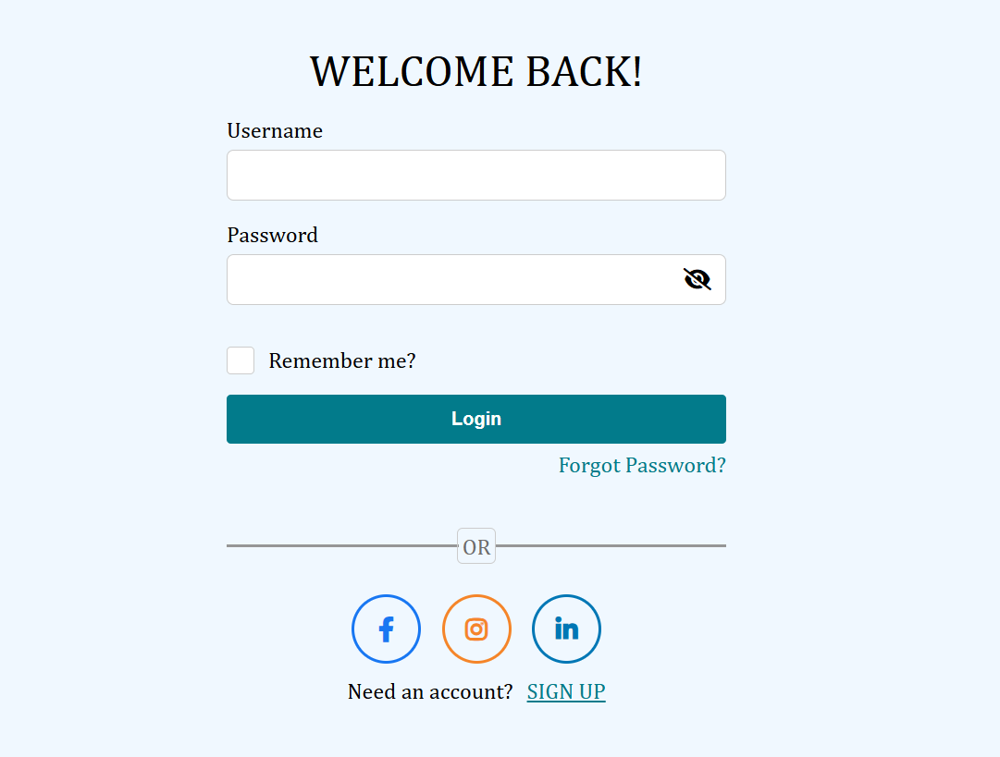

# Responsive and Interactive Login & Signup Page

### Login and Signup Pages
<div style="display: flex; gap: 20px;">
  
  
</div>


## 🌐 Live Demo
You can view the live version of the project here: [Live Demo](https://signupandloginpages.vercel.app/)


## 🚀 Overview
This project features a **responsive** and **interactive** login and signup page built with modern web technologies. It is designed to work seamlessly across devices, ensuring an optimal user experience on desktops, tablets, and smartphones.

## 🌟 Features
- **Responsive Design**: Adapts to all screen sizes using CSS Grid and Flexbox.
- **Interactive Elements**: Dynamic form validation using JavaScript.
- **Clean and Intuitive UI**: Focus on user-friendly navigation and aesthetics.
- **Customizable**: Easy to tweak colors, fonts, and layouts.

## 🔧 Technologies Used
- **HTML5**: For semantic structure.
- **CSS3**: For styling and responsiveness (Flexbox & Grid).
- **JavaScript**: For interactivity and form validation.
- **Font Awesome**: For icons.

## 📂 File Structure
```plaintext
.
├── 404-tick.png        # Tick icon for error messages
├── background1.png     # Background image
├── home.html           # Additional HTML file (e.g., for home page)
├── index.html          # Main HTML file
├── login.css           # CSS for login page styling
├── login.html          # HTML for login page
├── login.js            # JavaScript for login functionality
├── signup.css          # CSS for signup page styling
├── signup.js           # JavaScript for signup functionality
