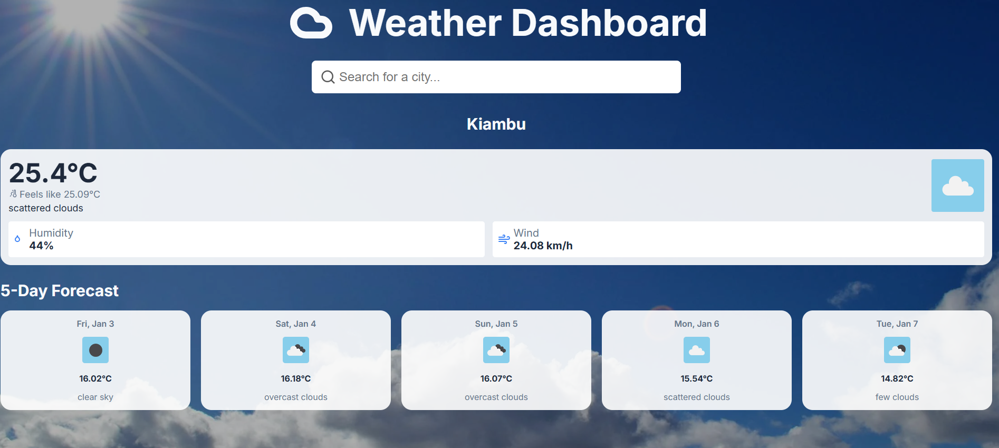
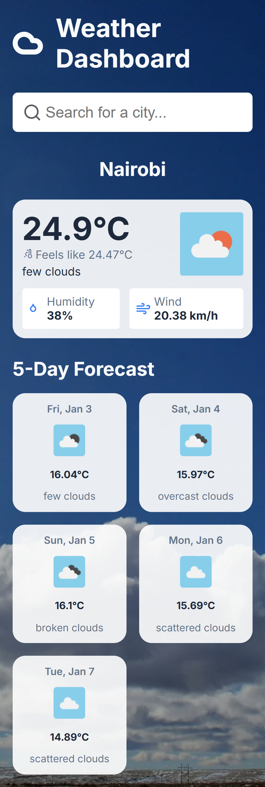

# Weather App

A simple, intuitive weather application that provides real-time weather updates based on your current location or any city of your choice. Built using **HTML**, **CSS**, and **JavaScript**, this app uses the **OpenWeather API** to deliver accurate weather information and supports an easy-to-use search feature.

## Features
- **Detects your current location**: Automatically fetches weather data based on your geographic coordinates.
- **Search by city**: Allows users to search for weather by typing any city name.
- **Geolocation support**: Requests location permissions to get weather for the user's current location.
- **Real-time weather data**: Fetches accurate weather details from the OpenWeather API.
- **Autocomplete search**: A smooth and intuitive search experience with suggestions as you type.

## Technologies Used
- **HTML**: For the structure and layout of the app.
- **CSS**: For styling and responsive design.
- **JavaScript**: For dynamic content updates and interaction with the OpenWeather API.
- **OpenWeather API**: Provides real-time weather data.

## How to Use
1. **Geolocation**: The app will automatically detect your current location (with your permission) and display the weather.
2. **Search for City**: Enter the name of any city to get weather details for that location.
3. **Autocomplete**: As you type in the search box, suggestions will appear to make it easier to find cities.

## Live Demo
You can view the app here: [Live Demo](https://weather-app-james-gitere.vercel.app)

## Screenshots

### Desktop and Mobile View

<div style="display: flex; gap: 20px; width: 800px;">
    
    
</div>

## Installation

If you would like to run this app locally, follow these steps:

1. Clone the repository:
   ```bash
   git clone https://github.com/gitere001/100-javascript-challenges.git
2. ```cd 100-javascript-challenges/weatherApp